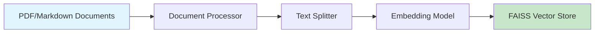
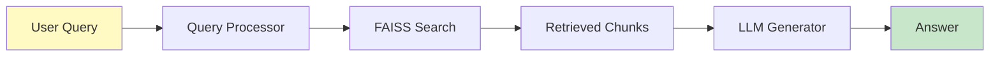
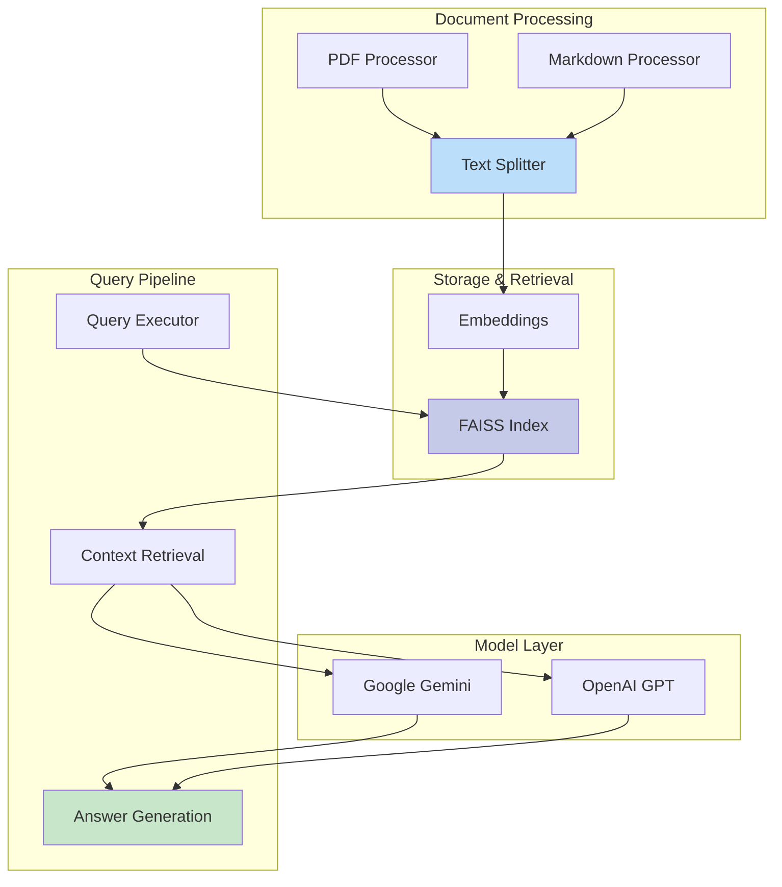
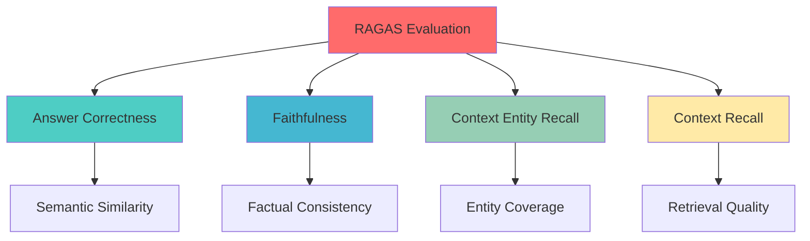
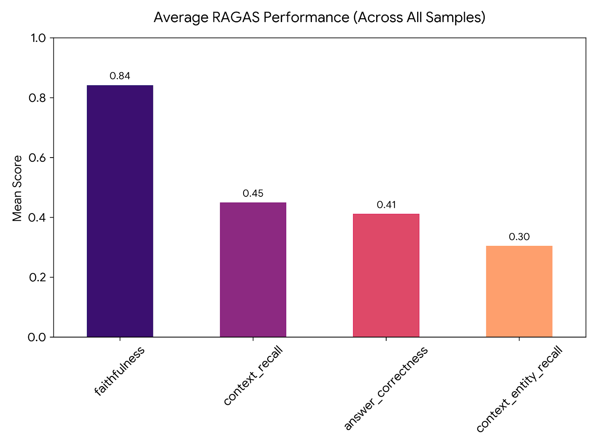
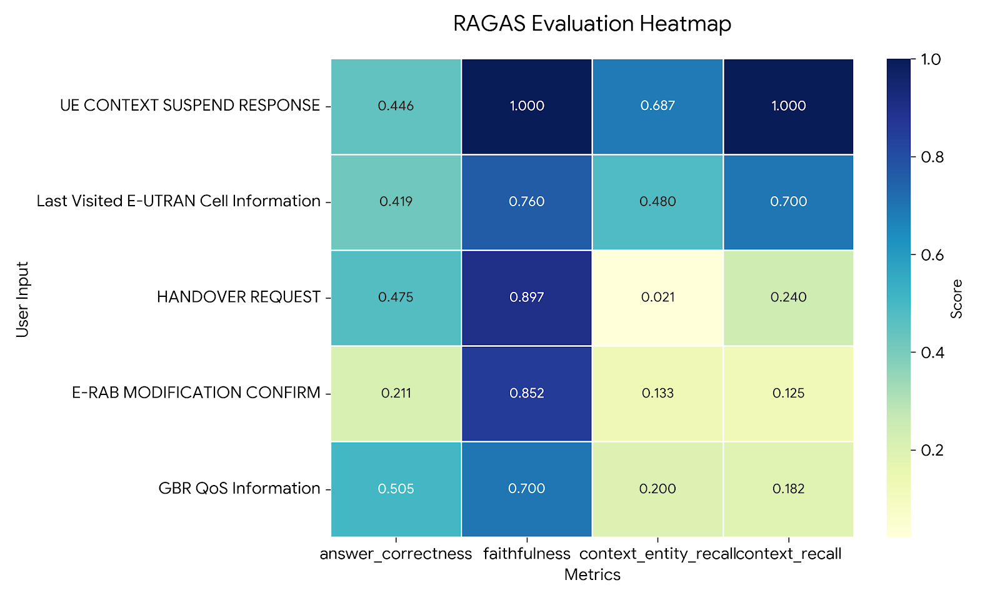
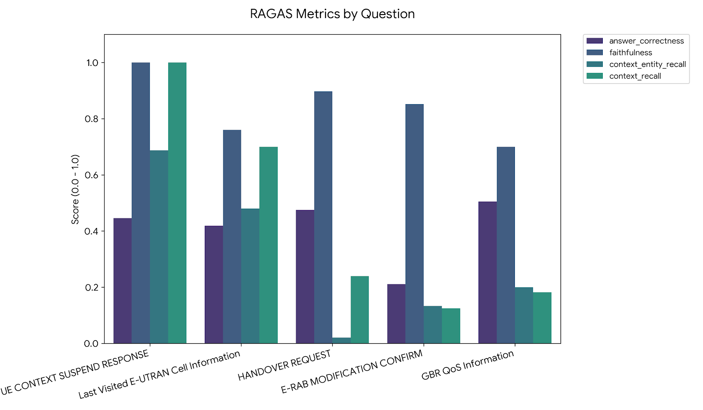

<div align="center">

# 🔍 3GPP Search Agent

**AI-Powered Retrieval-Augmented Generation for 3GPP Technical Specifications**

[](https://www.python.org/)
[](LICENSE)

</div>

---

## 📋 Overview

A Python-based RAG (Retrieval-Augmented Generation) application designed to intelligently search and answer questions about 3GPP technical specification documents. The system combines vector search with large language models to provide accurate, context-aware responses.

## ✨ Features

- 🚀 **Complete RAG Pipeline** - Data ingestion, indexing, and query processing
- 🤖 **Multi-Model Support** - Seamlessly switch between Google Gemini and OpenAI models
- ⚡ **Fast Vector Search** - FAISS-powered similarity search for efficient document retrieval
- 📄 **Multiple Formats** - Support for PDF and Markdown documents
- 📊 **Evaluation Framework** - Built-in RAGAS metrics for quality assessment

## 🏗️ Architecture

### Data Ingestion & Indexing Flow



### Query Processing Flow



### System Components



## 🛠️ Technology Stack

<div align="center">

| Category | Technologies |
|----------|-------------|
| **Language** |  |
| **LLM Providers** |   |
| **Framework** |  |
| **Vector DB** |  |
| **Evaluation** |  |
| **Testing** |  |
| **Code Quality** |   |

</div>

### Core Dependencies

```python
langchain              # LLM orchestration framework
langchain-google-genai # Google Gemini integration
langchain-openai       # OpenAI integration
faiss-cpu              # Vector similarity search
ragas                  # RAG evaluation metrics
pymupdf                # PDF processing
python-dotenv          # Environment management
```

## 📁 Project Structure

```
3gpp_search_agent/
├── src/search_agent/
│   ├── document_processors/    # PDF & Markdown processors
│   ├── models/                 # LLM model services
│   ├── evaluation/             # RAGAS evaluation scripts
│   ├── main.py                 # CLI entry point
│   ├── rag_pipeline.py         # RAG orchestration
│   ├── query_executor.py       # Query processing
│   └── prompts.py              # Prompt templates
├── data/                       # 3GPP documents
├── faiss_index/                # Vector store indices
├── tests/                      # Test suite
└── examples/                   # Usage examples
```

## 🚀 Getting Started

### Prerequisites

- Python 3.13+
- `uv` package manager (recommended) or `pip`
- API keys for Google Gemini or OpenAI

### Installation

1. **Clone the repository**
   ```bash
   git clone https://github.com/yourusername/3gpp_search_agent.git
   cd 3gpp_search_agent
   ```

2. **Install dependencies**
   ```bash
   uv sync
   ```

3. **Configure environment**
   
   Create a `.env` file in the root directory:
   ```bash
   GOOGLE_API_KEY=your_google_api_key_here
   OPENAI_API_KEY=your_openai_api_key_here
   ```

4. **Prepare documents**
   
   Place your 3GPP documents in the `data/` directory:
   - PDF format: `ts_124501v171600p.pdf`
   - Markdown format: `specification.md`

## 💻 Usage

### Running Queries

Query documents using the `--ie` (information element) and `--path` arguments:

```bash
uv run python -m search_agent.main --ie "RLF timer" --path "ts_136413v180400p.pdf"
```

### Model Selection

Specify a model with the `--model` flag:

```bash
uv run python -m search_agent.main \
  --ie "Handover procedure" \
  --path "ts_138413v161400p.pdf" \
  --model "gemini-2.5-flash"
```

**Available Models:**
- **Google Gemini**: `gemini-3-pro-preview` (default), `gemini-2.5-flash`
- **OpenAI**: `gpt-5-nano`, `gpt-4.0-turbo-preview`

## 📊 Evaluation with RAGAS

The system includes comprehensive evaluation using the [RAGAS](https://github.com/explodinggradients/ragas) framework, which assesses RAG system quality across multiple dimensions.

### Evaluation Metrics



| Metric | Description | Score Range |
|--------|-------------|-------------|
| **Answer Correctness** | Measures semantic similarity between generated and ground truth answers | 0.0 - 1.0 |
| **Faithfulness** | Evaluates factual consistency with retrieved context | 0.0 - 1.0 |
| **Context Entity Recall** | Assesses coverage of entities from ground truth in retrieved context | 0.0 - 1.0 |
| **Context Recall** | Measures how well retrieved context covers the ground truth answer | 0.0 - 1.0 |

### Running Evaluation

The evaluation script is located at `src/search_agent/evaluation/ragas_evaluator.py`:

```bash
uv run python -m search_agent.evaluation.ragas_evaluator
```

### Evaluation Results

The system was evaluated using **Google Gemini 2.5 Flash** as the judge model:

<div align="center">

#### Overall Performance



#### Metric Distribution



#### Detailed Analysis



</div>

Results are saved to `eval1_results.csv` for detailed analysis.

### Evaluation Dataset Format

```json
{
  "question": "What is the RLF timer?",
  "answer": "Generated answer from the RAG system",
  "contexts": ["Retrieved context chunk 1", "Retrieved context chunk 2"],
  "ground_truth": "Expected correct answer"
}
```

## 🧪 Development

### Running Tests

Execute the test suite:

```bash
uv run pytest
```

Run with coverage:

```bash
uv run pytest --cov=src/search_agent
```

### Code Quality

**Linting with Ruff:**
```bash
uv run ruff check .
```

**Type checking with MyPy:**
```bash
uv run mypy src/
```

**Auto-formatting:**
```bash
uv run ruff format .
```

## 📈 Performance Considerations

- **Chunk Size**: Documents are split into 1000-character chunks with 200-character overlap
- **Embedding Model**: Uses model-specific embeddings (Gemini or OpenAI)
- **Vector Search**: FAISS enables sub-second similarity search on large document collections
- **Caching**: FAISS indices are cached to disk for faster subsequent queries

## 🤝 Contributing

Contributions are welcome! Please follow these steps:

1. Fork the repository
2. Create a feature branch (`git checkout -b feature/amazing-feature`)
3. Commit your changes (`git commit -m 'Add amazing feature'`)
4. Push to the branch (`git push origin feature/amazing-feature`)
5. Open a Pull Request

## 📝 License

This project is licensed under the MIT License - see the [LICENSE](LICENSE) file for details.

## 🙏 Acknowledgments

- [LangChain](https://github.com/langchain-ai/langchain) for the RAG framework
- [RAGAS](https://github.com/explodinggradients/ragas) for evaluation metrics
- [FAISS](https://github.com/facebookresearch/faiss) for efficient vector search
- 3GPP for technical specifications

---

<div align="center">

**Built with ❤️ for the telecommunications community**

[Report Bug](https://github.com/yourusername/3gpp_search_agent/issues) · [Request Feature](https://github.com/yourusername/3gpp_search_agent/issues)

</div>
